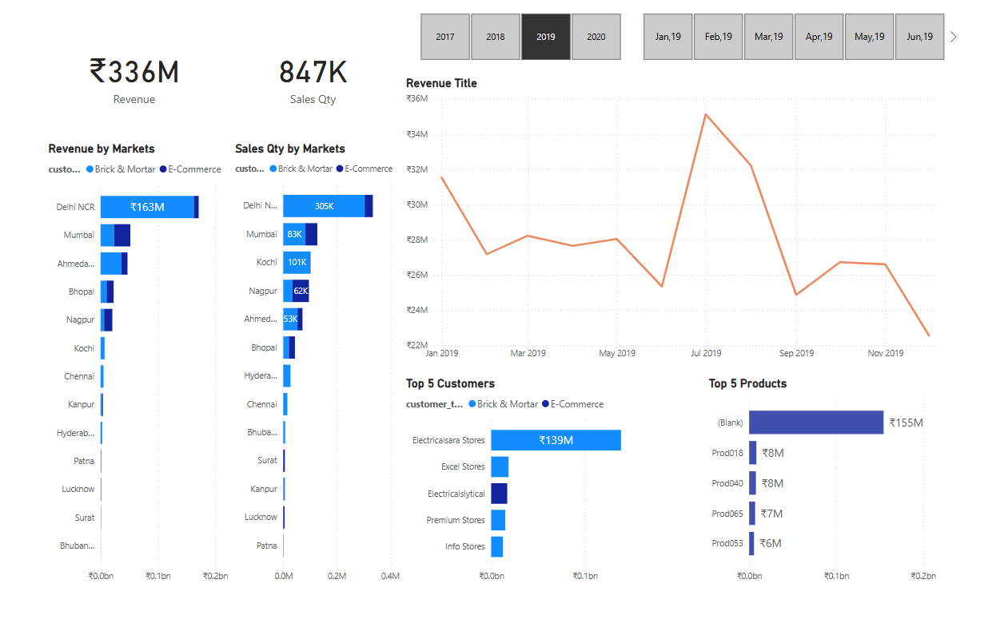

# 📈 Sales Insights Dashboard

This project is a guided **Sales Insights Dashboard** challenge led by the amazing team at **Codebasics**. The aim was to simulate a real-life business analytics scenario using **real-time databases** and tools like **MySQL** and **Power BI**, which provided a hands-on experience in working with sales data, KPIs, and performance trends.

🔗 [Live Dashboard](https://app.powerbi.com/view?r=eyJrIjoiYzdkY2M1MzMtZThlMy00NzZhLTlmMTgtZTZlZWMzZmZkY2FmIiwidCI6ImM2ZTU0OWIzLTVmNDUtNDAzMi1hYWU5LWQ0MjQ0ZGM1YjJjNCJ9)  
📎 [LinkedIn Post](https://www.linkedin.com/feed/update/urn:li:activity:7060960687992274944/)

---

## 🎯 Project Objectives

- Build an interactive and insightful dashboard for a Sales department
- Connect Power BI to a **real-time MySQL database**
- Provide **actionable insights** on revenue, product performance, customer behavior, and more
- Present the findings in a user-friendly and visually appealing format

---

## ✅ Key Skills & Learnings

- 🔌 Connected Power BI to a **MySQL** database to extract data
- 🔄 Performed **data cleaning and transformation** using Power Query
- 🧠 Created custom **DAX measures and KPIs**
- 🧩 Designed a dynamic and interactive **Power BI dashboard**
- 📊 Gained deep insights into sales performance, customer trends, and profitability

---

## 📊 Dashboard Highlights

- 📈 **Revenue Trends** by Month and Product
- 🧾 **Top & Bottom Performing Products**
- 🌍 **Sales by Region & Customer Segment**
- 🧑‍🤝‍🧑 **Customer Acquisition and Retention**
- 💰 **Profitability Analysis**
- 📌 KPI Cards for quick business insights

---

## 🛠 Tools Used

- **Power BI Desktop**  
- **Power Query**  
- **DAX (Data Analysis Expressions)**  
- **MySQL**  

---

## 📸 Dashboard Preview

---

## 🙋‍♂️ Let's Connect

📬 [Connect with me on LinkedIn](https://www.linkedin.com/in/himelds/)

---
